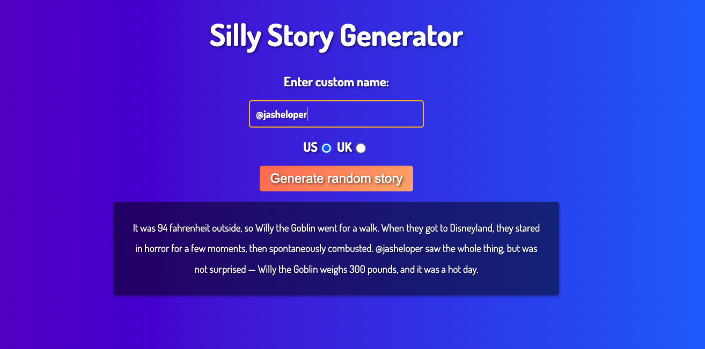

# JavaScript Silly Story Generator

To test comprehension of JavaScript fundamentals, such as variables, numbers, operators, strings, and arrays.

Demo @ https://jasheloper.github.io/silly-story-js/

 

 

## Link to Requirements

https://developer.mozilla.org/en-US/docs/Learn/JavaScript/First_steps/Silly_story_generator

